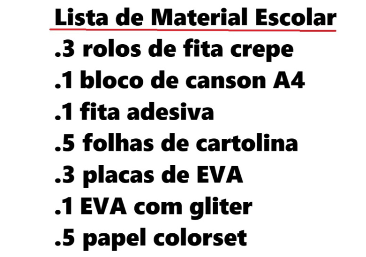

# Desafio 

A parti dessa imagem:



Conseguir processas as palavras

## Etapas necessário 

Para extrair texto de uma imagem usando o **Amazon Textract** da AWS, você pode seguir os passos abaixo. Vou detalhar desde a configuração até a execução do código.

### **1. Configuração Inicial**

#### a) **Criar uma Conta na AWS**
Se ainda não tiver, crie uma conta no [AWS](https://aws.amazon.com/).

#### b) **Criar um Usuário com Permissões no IAM**
1. Acesse o [IAM (Identity and Access Management)](https://console.aws.amazon.com/iam/).
2. Crie um novo usuário e atribua permissões.
   - **Permissão necessária:** `AmazonTextractFullAccess`.

#### c) **Instalar o AWS CLI e Configurar Credenciais**
1. **Instalar o AWS CLI:**
   ```bash
   sudo apt-get install awscli  # Para Linux (Ubuntu)
   ```

2. **Configurar suas credenciais:**
   ```bash
   aws configure
   ```
   - **AWS Access Key ID:** (chave gerada no IAM)
   - **AWS Secret Access Key:** (chave secreta gerada)
   - **Region:** ex: `us-east-1`
   - **Output format:** `json`

---

### **2. Instalando o Boto3 (SDK da AWS para Python)**

O **Boto3** é a biblioteca Python que permite interagir com os serviços da AWS.

```bash
pip install boto3
```

---

### **3. Código Python para Usar o Amazon Textract**

Aqui está um exemplo simples de como extrair texto de uma imagem local usando o Textract:

```python
import boto3

# Inicializa o cliente Textract
textract = boto3.client('textract')

# Caminho da imagem (pode ser local ou no S3)
image_path = 'caminho_para_sua_imagem.jpg'

# Lê a imagem
with open(image_path, 'rb') as document:
    image_bytes = document.read()

# Chamada para o Textract
response = textract.detect_document_text(Document={'Bytes': image_bytes})

# Extrai e imprime o texto detectado
for item in response['Blocks']:
    if item['BlockType'] == 'LINE':
        print(item['Text'])
```

---

### **4. Usando Imagens no S3**

Se você preferir usar imagens armazenadas no **Amazon S3**, use o seguinte código:

```python
response = textract.detect_document_text(
    Document={
        'S3Object': {
            'Bucket': 'nome-do-seu-bucket',
            'Name': 'caminho/para/sua_imagem.jpg'
        }
    }
)

# Imprime o texto detectado
for item in response['Blocks']:
    if item['BlockType'] == 'LINE':
        print(item['Text'])
```

---

### **5. Resultados Esperados**

O `Textract` retorna uma estrutura chamada `Blocks`, que contém diferentes tipos de informações como:
- **LINES**: Linhas de texto completas.
- **WORDS**: Palavras individuais.
- **TABLES** e **FORMS**: Estruturas de tabelas e formulários.

Você pode filtrar para capturar apenas o que precisa (no exemplo acima, apenas linhas de texto são extraídas).

---
