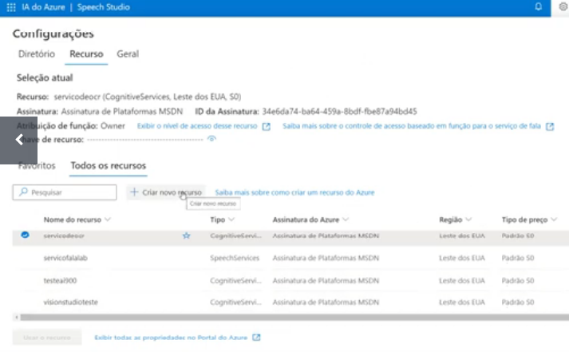
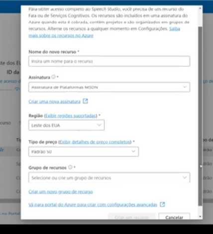
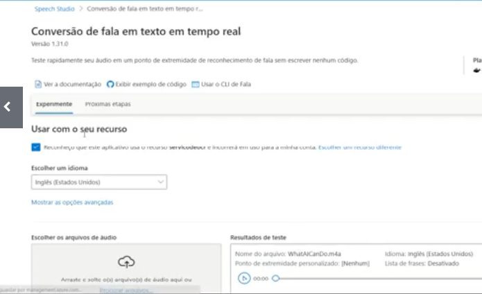
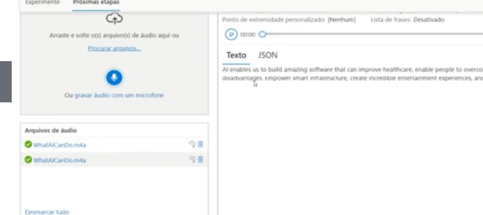
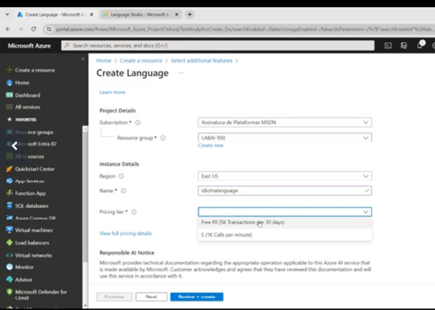
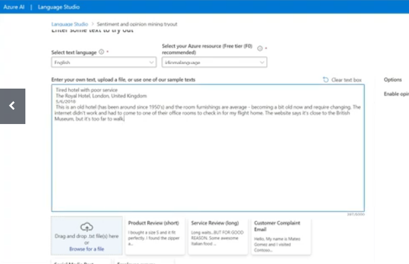
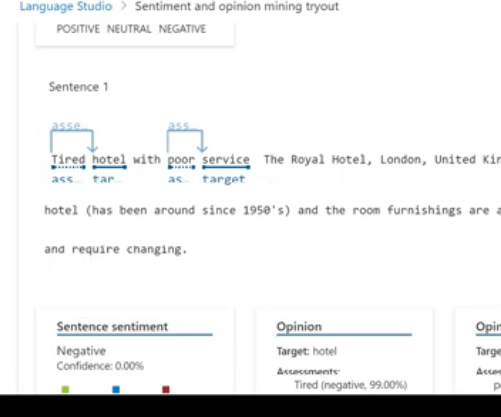

#  Para que serve?

- Serve para fazer analise de texto.
- descrição do audio 

# Descrição do audio

## Configuração 

[https://azure.microsoft.com/pt-br/products/ai-services/text-to-speech](https://azure.microsoft.com/pt-br/products/ai-services/text-to-speech)

Vá em configuração 

Caso não tenha `recurso` então click em `criar novo recurso`

Vá em conversão para fala em texto

## Aplicação 

Selecione o idioma e carregue o arquivo 

# Analise de sentimento 

## configuração 

## Resultado 

