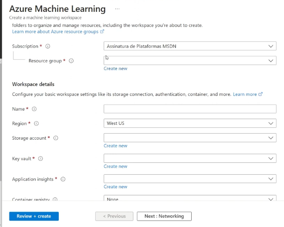
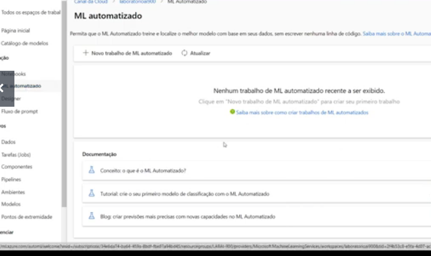
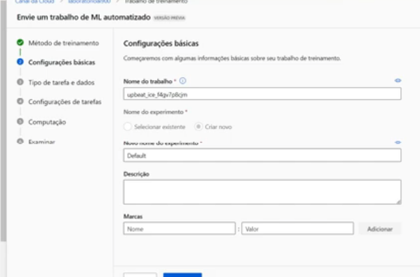

# Acessando Azure Machine Learning

na barra coloque Azure Machine  

Clique 

Preencha o formulário 

> [!WARNING]
> Não coloque Brasil pois o serviço é sempre mais caro 

# Configulando Modelos e Conjuntos de dados 

Vá em `ML automatizados`

Click no `novo` 

## Configulação básica

Prencha conforme o seu gosto, nos vamos usar o modelo de dados de bicicleta de acordo com a documentação https://microsoftlearning.github.io/AI-900-AIFundamentals.pt-BR/Instructions/02-module-02.html

## Tipo de tarefa e dados

Vamos usar o tipo de Regressão 

## URL da Web

Vamos usar esse banco de dados `https://aka.ms/bike-rentals`

### Configulações 

Nessa parte unica coisa que precisamos musar é no `cabeçalho de coluna` coloque a opção de `Somente o primeiro arquivo tem cabeçalho`

### Esquema 

Não tem nada a fazer

### Examinar 

nada a ser feito 

## Configulação de tarefa 

Colocar a opção `NormalizeRootMeanSquareError`  na `Métrica primária`

# Analise de teste  de Modelo 

