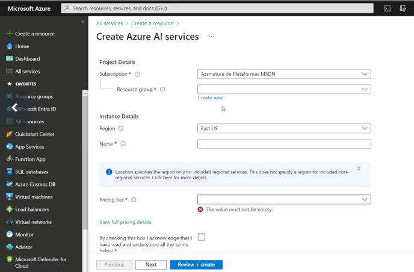
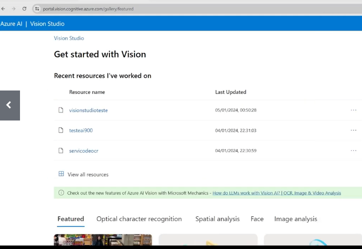
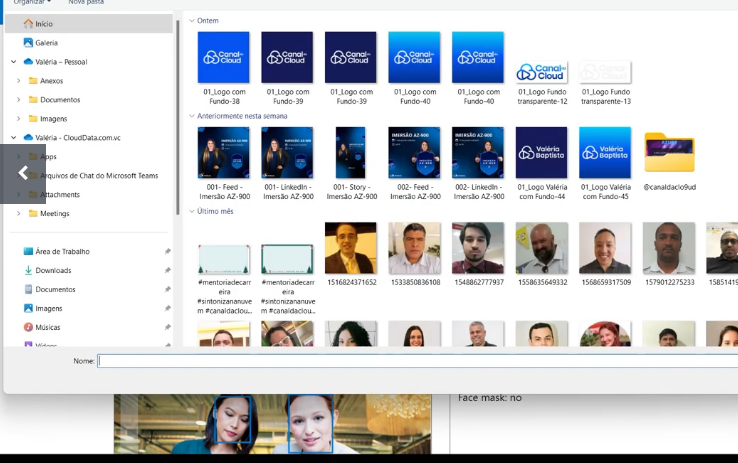

# Links Importantes

- [Detect faces in Vision Studio](https://microsoftlearning.github.io/mslearn-ai-fundamentals/Instructions/Labs/04-face.html)

- [Read text in Vision Studio](https://microsoftlearning.github.io/mslearn-ai-fundamentals/Instructions/Labs/05-ocr.html)

- [Analyze images in Vision Studio](https://microsoftlearning.github.io/mslearn-ai-fundamentals/Instructions/Labs/03-image-analysis.html)

# Configuração do Serviço

Vá no `Azure AI service` e click no `create`

Obs:  não coloque região Brasil pois geralmente é mais caro.

Após prencher o formulário vai no portal

# Aplicação

Vamos na Imagem, carregue uma foto sua e vais perceber que ele vai conseguir dectar.

